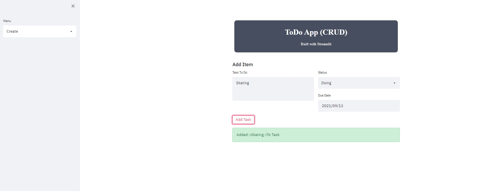
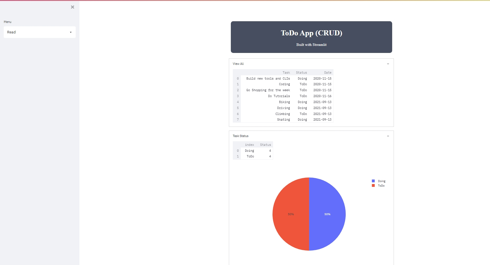

# Todo-with-Graph

To use this app, you need to download the below libraries with pip:
 - Streamlit
 - Pandas
 - Plotly
 - Matplotlib
 #
 #

With all libraries successfully downloaded, navigate to the root directory and issue: ```streamlit run app.py```
# 
# 


#
#
#

